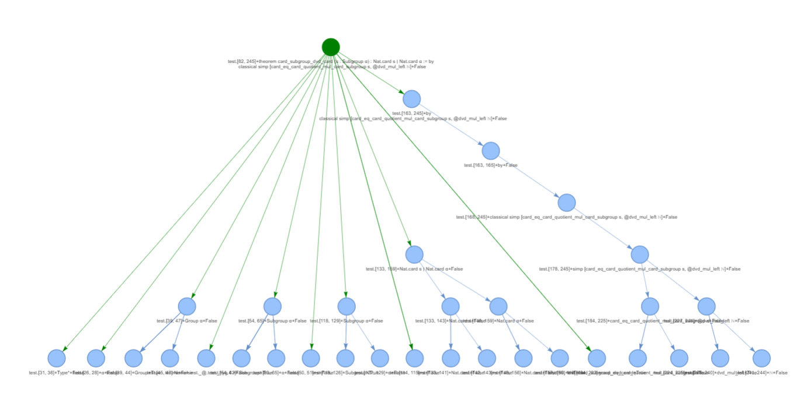
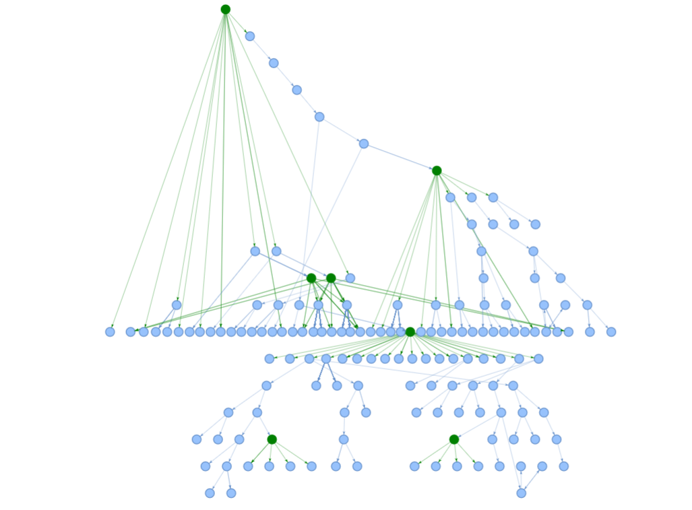
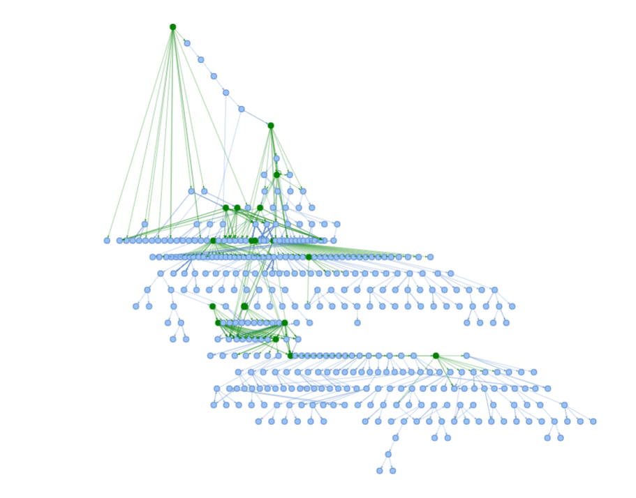

# lean-sketch

A tool that analyze the logic structure of lean codes to extract crucial proof steps. Then it prompts LLMs to generate proof sketches in natural language.

### Current status
- Using *jixia* to build a ELAB tree      
- Using *Paperproof* to build a GOAL tree  

Extracting informations from these two trees.

---

### Example: Extracting Elab Tree for Lagrange Theorem in Group Theory
Level 0 Dependency:

Level 1 Dependency:

Level 2 Dependency:

